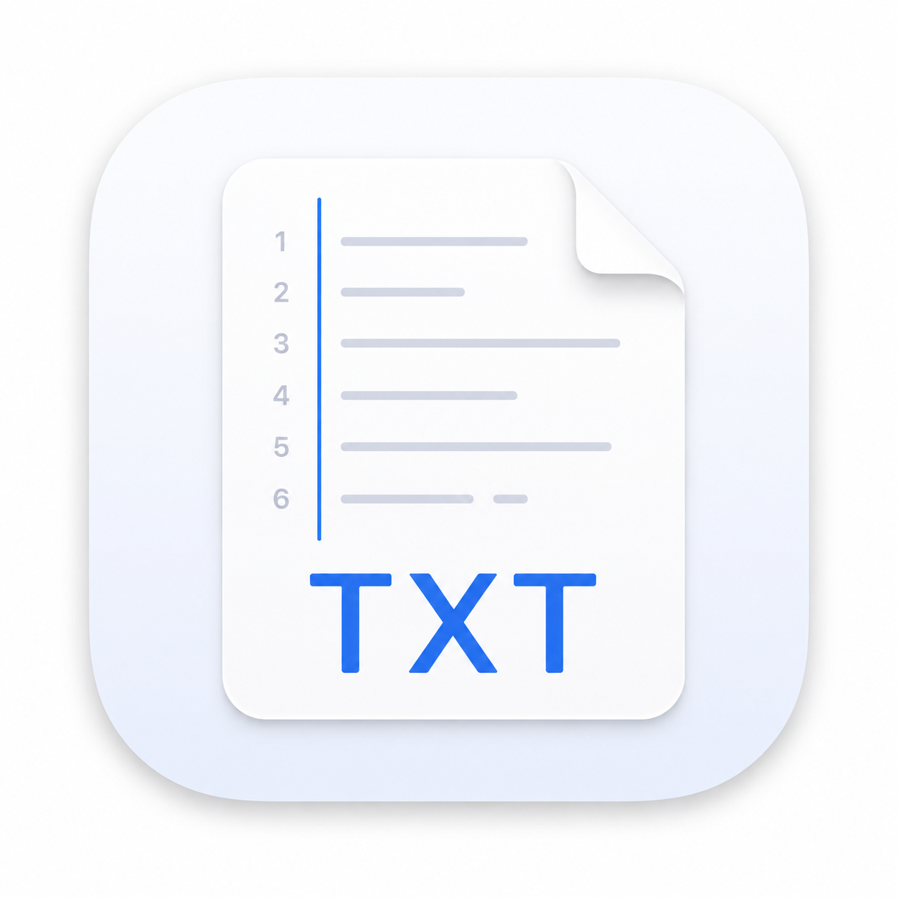

# TXT

**一款现代、轻量化、多标签的纯文本编辑器，支持 Windows、Linux 和 macOS。**

TXT 旨在成为更好的系统默认文本编辑器。

<a href="README.md">English</a> · <a href="README.zh-CN.md">简体中文</a>

## 为什么需要 TXT？

目前的系统默认文本编辑器通常存在两个方向的问题：

* **功能过于基础** —— 难以满足稍复杂的文本编辑需求。
* **专业编辑器过于复杂** —— IDE 和大型编辑器提供了大量普通用户并不需要的功能。

TXT 希望找到两者之间的平衡：

> **比基础系统编辑器更强，**
> **比开发环境更简单、更轻量。**

TXT 不希望成为另一个功能堆砌的编辑器。

我们的目标是打造一款足够优秀的文本编辑器，未来甚至可以成为**操作系统的默认文本编辑器**。

## 核心设计

### 1. 强制纯文本

TXT 是一款**纯文本编辑器**。

粘贴富文本时自动转换为纯文本。

不处理 RTF、HTML 格式，也不加入不必要的文档编辑功能。

### 2. 轻量化 & 原生

快速启动、低资源占用、小体积。

**不使用 Electron。**

在可行的情况下，优先采用轻量化、原生的技术方案。

### 3. 极简多标签

多个文档，一个简单的界面。

不使用传统菜单栏。

功能通过右键菜单、命令面板和简洁的工具栏提供。

### 4. 永不轻易丢失工作

关闭标签页不意味着丢失未保存内容。

未保存的文档会静默保存到**加密本地缓存**，下次打开 TXT 时自动恢复。

用户不需要主动考虑数据恢复。

### 5. 大文件，高性能

TXT 从底层开始针对大型文本文件进行设计。

采用 Rope 文本结构，减少不必要的数据复制，保持编辑过程中的响应速度。

### 6. 默认安全

会话数据和临时文档可能包含敏感信息。

本地缓存采用加密存储，并在可用的情况下使用操作系统提供的安全存储机制。

## 技术架构

| 模块   | 技术                      |
| ---- | ----------------------- |
| 编程语言 | Rust                    |
| GUI  | Slint                   |
| 文本缓冲 | Rope                    |
| 语法高亮 | syntect                 |
| 编码   | encoding_rs             |
| 加密   | AES-256-GCM             |
| 平台   | Windows / Linux / macOS |

TXT 有意避免 Electron，采用轻量化的原生架构。

## 产品原则

TXT 只有一个核心原则：

> **最大公约数，最少不必要的功能。**

每一个新功能都应该回答一个问题：

**大多数用户真的需要它吗？**

如果不是，它可能就不属于 TXT。

## Roadmap

开发路线将由真实用户需求和社区讨论共同决定。

初期重点：

* [ ] 核心文本编辑
* [ ] 多标签
* [ ] 跨平台支持
* [ ] 会话恢复
* [ ] 大文件性能
* [ ] 编码支持
* [ ] 加密缓存
* [ ] 语法高亮
* [ ] 安装包与发行

## 参与贡献

**TXT 正在寻找开发者、设计师、测试人员，以及任何希望打造更好日常文本编辑器的人。**

你可以参与：

* 代码开发
* UI / UX
* 性能优化
* 安全
* 测试
* 文档
* 多语言
* 产品讨论
* Bug 报告

即使你不是开发者，也可以参与 TXT。

产品方向本身也欢迎讨论。

**如果你认为日常文本编辑器可以更简单、更快速、更好用，欢迎加入 TXT。**

## 开源协议

TXT 是免费、开源的软件，采用 **MIT License**。

欢迎贡献代码、Fork、修改和再分发。

---

  Built with Rust · Slint · and a focus on simplicity.

